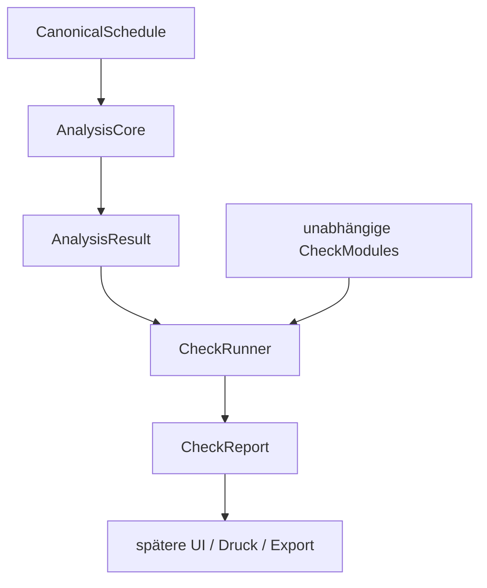

# Check Framework

## Architektur



`check-runner.js` kennt nur ein technisches Modulinterface und das Format von `AnalysisResult` bzw. `CheckResult`. Er enthält keine BV-, ArbZG-, FPersV-, Wagenkarten- oder sonstige Fachlogik.

## CheckModule-Schnittstelle

Ein Modul ist ein Objekt mit folgender Form:

```js
{
  id: 'eindeutige-modul-id',
  name: 'Lesbarer Modulname',
  category: 'BV', // BV | ARBZG | FPERSV | INTERNAL | WAGENKARTE | CUSTOM
  priority: 100, // höhere Werte zuerst; optional, Standard 0
  enabled: true, // optional, Standard aktiviert
  async run(analysisResult) {
    return checkResult; // CheckResult, CheckResult[] oder null
  }
}
```

Das Modul erhält ausschließlich ein `AnalysisResult`. Es darf Ergebnisse nicht in den Input schreiben. Der Runner führt synchrone und asynchrone Module aus, sortiert sie stabil nach Priorität und isoliert jeden Modulfehler.

## CheckResult

Jedes Ergebnis besitzt mindestens folgende Struktur:

```js
{
  id: 'check-result-id',
  name: 'Lesbarer Checkname',
  category: 'BV',
  severity: 'WARNING', // INFO | WARNING | ERROR | VIOLATION
  status: 'FAIL',      // PASS | FAIL | SKIP | NOT_APPLICABLE
  message: 'Kurzbeschreibung',
  details: {},
  affectedServices: ['service:...'],
  affectedActivities: ['activity:...'],
  sourceReferences: [{ /* vorhandene Quellenreferenz */ }]
}
```

`details` ist absichtlich fachoffen. IDs und Quellenreferenzen erlauben später die Rückverfolgung bis zur PDF- oder Excelquelle, ohne dass der Runner Dokumentwissen besitzen muss.

## CheckReport und Lebenszyklus

`runCheckModules(analysisResult, modules, options)` erzeugt einen `CheckReport`:

- `results`: validierte CheckResults;
- `errors`: isolierte technische Modulfehler;
- `disabledModules`: nicht ausgeführte Module mit Grund;
- `moduleRuns`: Priorität, Status, Ergebnisanzahl und Laufzeit jedes ausgeführten Moduls;
- `summary`: Modul-, Treffer-, Fehler-, Deaktivierungs- und Gesamtlaufzeit;
- `metadata`: Framework-Version sowie aktive Kategorien.

Optionen unterstützen `categories`, `disabledModuleIds` und `enabledModuleIds`. Ein Fehler oder ein ungültiges Ergebnis stoppt kein nachfolgendes Modul; es wird als technischer Fehler im Report erfasst.

## Erweiterung

Neue Fachmodule werden ausschließlich in ihrem Bereich angelegt:

```text
js/v2/checks/
├── bv/
├── arbzg/
├── fpersv/
├── wagenkarte/
├── internal/
└── custom/
```

Die Ordner enthalten derzeit nur `.gitkeep`-Platzhalter. Es existiert noch kein fachliches Modul und keine fachliche Regel. Ein neues Modul implementiert das Interface, wird vom aufrufenden Code registriert und kann ohne Änderung am Runner unabhängig getestet werden.
