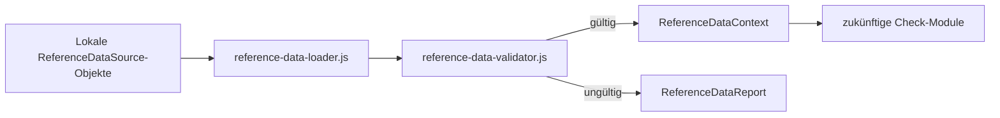

# Referenzdatenmodell

## Zweck und Abgrenzung

Die Referenzdatenschicht stellt künftig die einzige technische Schnittstelle für fachliche Zusatzdaten bereit. Sie enthält keine BV-, ArbZG-, FPersV- oder Wagenkartenregeln und verändert weder `AnalysisCore`, `CheckRunner` noch bestehende Checks.



## Unterstützte Bereiche

| Bereich | Kennung |
| --- | --- |
| Planmetadaten | `PLAN_METADATA` |
| Ortsstamm | `LOCATION_CATALOG` |
| Wegezeiten | `TRAVEL_TIMES` |
| Ausnahmefreigaben | `EXCEPTION_APPROVALS` |
| Turnusdaten | `ROTATION_DATA` |
| Personaldaten | `PERSONNEL_DATA` |
| BV-Anlagen | `BV_APPENDICES` |
| Wagenkarten | `WAGENKARTE` |

## Datenquellenvertrag

Jede lokale Quelle folgt diesem neutralen Umschlag:

```js
{
  type: 'ReferenceDataSource',
  id: 'locations:j:2025',          // eindeutig und stabil
  area: 'LOCATION_CATALOG',
  version: '1.0.0',                // fachliche Datenversion (SemVer)
  schemaVersion: '1.0',            // Version dieses technischen Vertrags
  optional: true,                  // explizit, nie implizit
  active: true,                    // optional; Standard true
  data: { /* fachoffener Inhalt */ }
}
```

Pro Bereich darf höchstens eine aktive Quelle existieren. Inaktive historische Quellen dürfen mitgeführt werden. Bereichsspezifische Felder in `data` werden absichtlich noch nicht geprüft; sie gehören erst zu einem späteren Datenanbieter bzw. Check-Modul.

## Laden und Validierung

`loadReferenceDataContext(sources, options)` arbeitet vollständig lokal. Das Ergebnis ist:

```js
{
  context, // ReferenceDataContext oder null bei Validierungsfehlern
  report   // ReferenceDataReport
}
```

Der Validator prüft Quellentyp, ID, Bereich, SemVer-Version, Schema-Version, das explizite `optional`-Merkmal, Datencontainer, Dubletten, aktive Konflikte und über `requiredAreas` angeforderte Bereiche. Fehlende optionale Bereiche sind im Report sichtbar, machen den Context aber nicht ungültig.

`ReferenceDataReport` enthält verfügbare und fehlende Bereiche, Versionen, Warnungen und Fehler. `toReferenceDataReportDebugJson` sowie `toReferenceDataContextDebugJson` liefern die Debugdarstellung ohne UI.

## Zugriff zukünftiger Checks

Zukünftige Checks erhalten Referenzdaten ausschließlich über den Context:

```js
if (referenceDataContext.has('LOCATION_CATALOG')) {
  const locations = referenceDataContext.get('LOCATION_CATALOG');
  const version = referenceDataContext.getVersion('LOCATION_CATALOG');
}
```

`get` und `getSource` liefern defensive Kopien. Ein Check kann daher keinen gemeinsamen Referenzdatenbestand oder andere Checkläufe verändern. Direkte Imports einzelner Referenzdateien und Direktzugriffe auf Datenquellen sind nicht vorgesehen.
