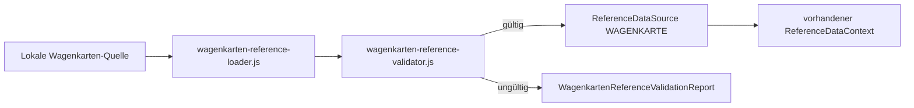

# Wagenkarten als Referenzdatenquelle – Phase 1

## Umfang

Wagenkarten werden in dieser Phase ausschließlich als `ReferenceDataSource` mit dem Bereich `WAGENKARTE` vorbereitet. Die Integration übernimmt vorhandene Beobachtungsdaten unverändert; sie berechnet keine Lenkzeit und führt keine BV-, ArbZG- oder FPersV-Prüfung aus.



## Datenvertrag

```js
{
  type: 'ReferenceDataSource',
  id: 'wagenkarte:schule:2026-08-17',
  area: 'WAGENKARTE',
  version: '1.0.0',
  schemaVersion: '1.0',
  optional: true,
  data: {
    cards: [{
      id: 'wk:1103',
      serviceNumber: '1103',
      vehicle: 'BUS-42',
      start: { time: '05:50', stop: 'Burgau' },
      end: { time: '14:10', stop: 'Burgau' },
      trips: [{
        sequence: 1,
        tripType: 'SERVICE', // SERVICE | DEAD_RUN
        line: '14',          // für DEAD_RUN nicht erforderlich
        course: '1103',      // für DEAD_RUN nicht erforderlich
        departure: { time: '06:00', stop: 'Jena West' },
        arrival: { time: '06:20', stop: 'Lobeda' },
        stops: [
          { sequence: 1, name: 'Jena West', time: '06:00', event: 'DEPARTURE' },
          { sequence: 2, name: 'Lobeda', time: '06:20', event: 'ARRIVAL' }
        ]
      }]
    }]
  }
}
```

Der Vertrag erfasst Fahrtfolge, Haltestellenfolge, Linie, Kurs, Dienst, Fahrzeug sowie Start-, End- und Zeitpunkte. `DEAD_RUN` darf Linie und Kurs auslassen; es wird dadurch nicht als Linienfahrt interpretiert.

## Validierung und Laden

`validateWagenkartenReferenceSource(source)` prüft zusätzlich zum vorhandenen `ReferenceDataSource`-Umschlag:

- Bereich `WAGENKARTE`, ID und SemVer-Version;
- eindeutige Wagenkarten- und Dienstkennungen;
- Dienst, Fahrzeug, Start und Ende;
- vollständige Fahrtfolge mit positiver, eindeutiger Sequenz;
- Linien- und Kursangabe für Linienfahrten;
- mindestens zwei zeitlich bezeichnete Haltestellen pro Fahrt mit streng aufsteigender Sequenz.

`loadWagenkartenReferenceSource(source)` liefert bei Fehlern keinen Source (`source: null`) und einen `WagenkartenReferenceValidationReport`. Bei gültigem Ergebnis kann die Quelle unverändert an `loadReferenceDataContext([source])` übergeben werden. Der bestehende `ReferenceDataReport` führt sie dann unter `availableData: ['WAGENKARTE']` und mit ihrer Version auf.

## Abgrenzung

Es gibt keine Lenkzeitberechnung, keine Summierung von Fahrtzeiten, keine Interpretation von Pausen oder Dienstteilen und keine fachliche Prüfung. Der Legacy-Wagenkartenparser in `index.html` bleibt unverändert. Eine spätere Phase kann die hier validierten Beobachtungsdaten über den bestehenden `ReferenceDataContext` konsumieren.
